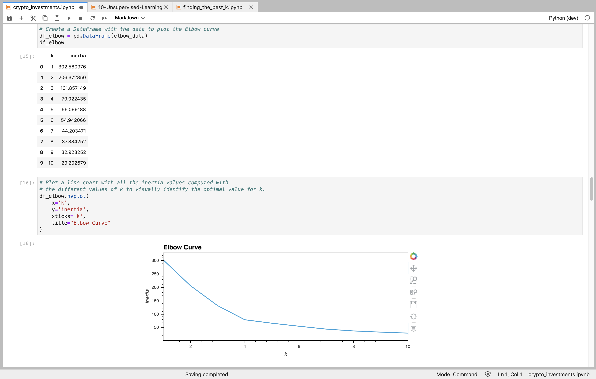
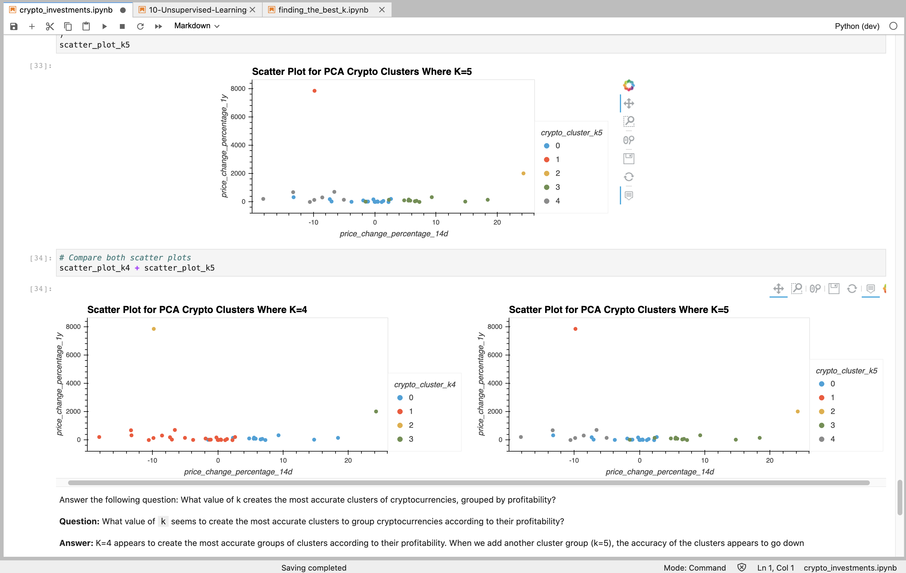

# Module 10 Challenge

This is the repository for my module 10 challenge. In this module challenge, we applied unserpervised machine learning algorithims from the Python scikit-learn library to analyze crypto investments.

Our first step in this challenge was to import and prepare the data that was provided to us. Next, we used K-means to cluster the cryptocurrencies according to price changes. Next, we used the elbow method and plotted a line chart to fine the best value for k. We then optimized clusters and reduced to 3 principal components using Principal Component Analysis. Lastly, using the PCA data, we plotted results for both k=4 and k=5 to determine the best possible value for k. 

---

## Technologies

Import the following at the beginning of your jupyter notebook:

```python
import pandas as pd
import hvplot.pandas
from path import Path
from sklearn.cluster import KMeans
from sklearn.decomposition import PCA
from sklearn.preprocessing import StandardScaler
```

---

## Example

This image shows how we used the elbow method and generated the line chart that showed us the best value for K.



The following image shows the comparison of a scatter plot for PCA Crypto clusters Where K=4 and a scatter plot for PCA Crypto clusters Where K=5. Notice how k=4 appears to cluster the groups more accurately.



---

## Contributors

UCB Fintech Bootcamp, Wynham Guillemot 

---

## License

MIT License

Copyright (c) [2021] [UCB Fintech Bootcamp, Wyham Guillemot]

Permission is hereby granted, free of charge, to any person obtaining a copy
of this software and associated documentation files (the "Software"), to deal
in the Software without restriction, including without limitation the rights
to use, copy, modify, merge, publish, distribute, sublicense, and/or sell
copies of the Software, and to permit persons to whom the Software is
furnished to do so, subject to the following conditions:

The above copyright notice and this permission notice shall be included in all
copies or substantial portions of the Software.

THE SOFTWARE IS PROVIDED "AS IS", WITHOUT WARRANTY OF ANY KIND, EXPRESS OR
IMPLIED, INCLUDING BUT NOT LIMITED TO THE WARRANTIES OF MERCHANTABILITY,
FITNESS FOR A PARTICULAR PURPOSE AND NONINFRINGEMENT. IN NO EVENT SHALL THE
AUTHORS OR COPYRIGHT HOLDERS BE LIABLE FOR ANY CLAIM, DAMAGES OR OTHER
LIABILITY, WHETHER IN AN ACTION OF CONTRACT, TORT OR OTHERWISE, ARISING FROM,
OUT OF OR IN CONNECTION WITH THE SOFTWARE OR THE USE OR OTHER DEALINGS IN THE
SOFTWARE.
